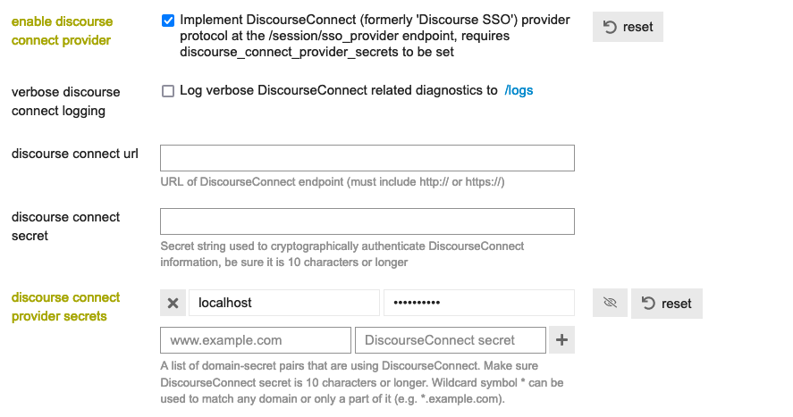

## INSTALLATION

### Configure composer authentication
```shell
composer config --global --auth http-basic.el7cosmos.repo.repman.io <token>
```

### Add composer repository
```shell
composer config repositories.el7cosmos composer https://el7cosmos.repo.repman.io
```

### Add module to composer requirements
```shell
composer require el7cosmos/social_auth_discourse
```

## CONFIGURATION

### Enable DiscourseConnect provider setting
Under Discourse admin site settings (`/admin/site_settings/category/login`) enable setting `enable discourse connect provider` and add a secret string to `discourse connect provider secrets`.



The provided secret must match with the secret in Drupal configuration.

### Configure Drupal Social Auth Discourse settings
Configure the social auth discourse module in `Administration » Configuration » Social API settings » User authentication » Discourse` or via URL `admin/config/social-api/social-auth/discourse`

Fill the `Secret` setting with the same value as the discourse setting above.
